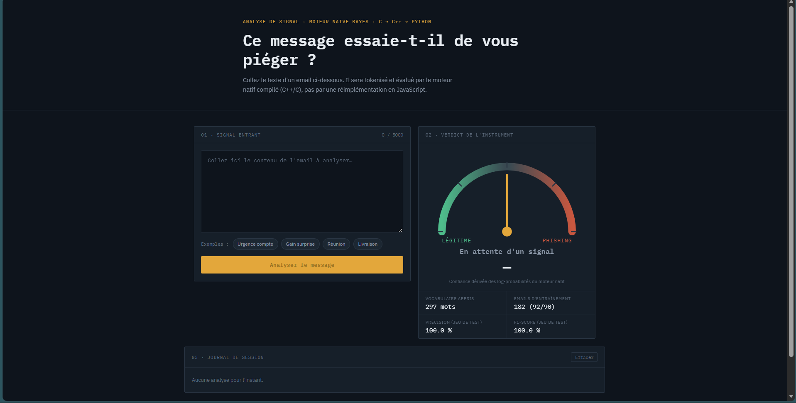
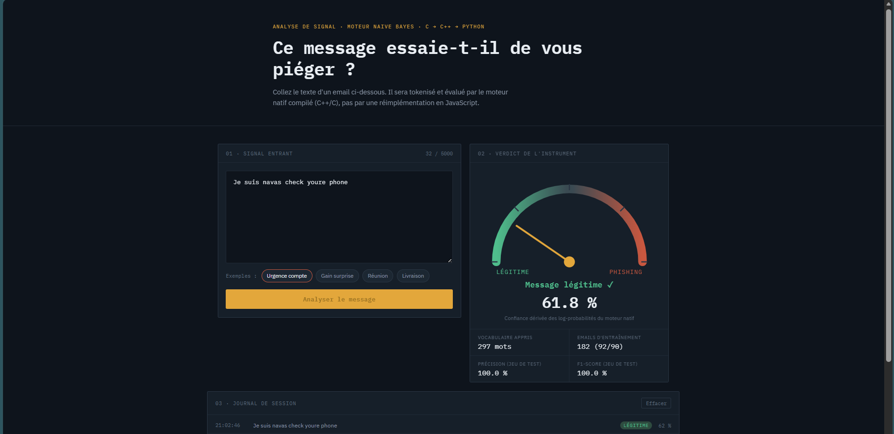
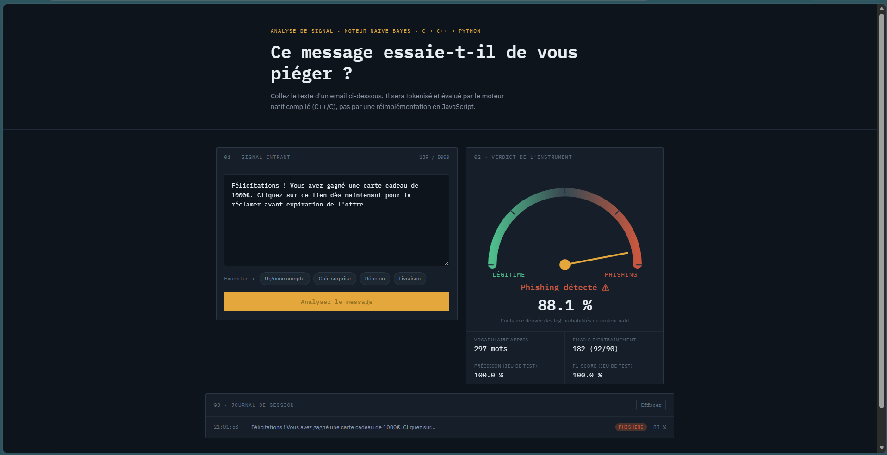
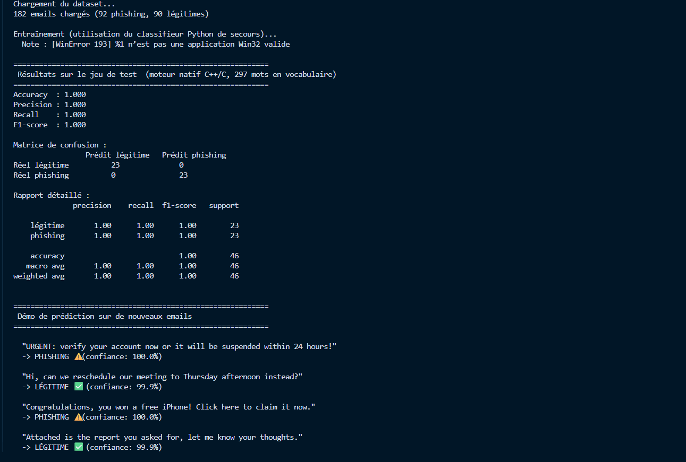

## 🌐 Live Demo

L'interface de démonstration est disponible ici :

**https://amine-navas.github.io/phishing_detector/**

> ⚠️ Cette version est une démonstration statique de l'interface.
> Les prédictions en temps réel nécessitent le backend Flask (Python + C/C++) exécuté localement.

Un seul détecteur de phishing, construit en couches : chaque langage a un rôle
précis et s'appuie sur le précédent. Ce n'est **pas** trois implémentations
séparées du même algorithme, mais un pipeline unique où Python appelle du
code C++ compilé, qui lui-même s'appuie sur des primitives C.

# Phishing Email Detector — pipeline C / C++ / Python

## Interface



---

## Prediction Example




---

## Training



```
 Python (orchestration, data, évaluation)
     │  ctypes
     ▼
 C++ (modèle Naive Bayes, classe orientée objet)
     │  appels de fonctions directs
     ▼
 C (tokenizer + table de hachage, bas niveau, rapide)
```

## Pourquoi cette architecture ?

| Couche                                     | Rôle                                                                                                                                    | Ce qu'elle apporte                                                                       |
| ------------------------------------------ | --------------------------------------------------------------------------------------------------------------------------------------- | ---------------------------------------------------------------------------------------- |
| **C** (`c/textutils.c`)                    | Tokenizer + table de hachage (chaînage, hash djb2)                                                                                      | Vitesse brute, pas d'allocations inutiles, structures de données explicites              |
| **C++** (`cpp/naive_bayes.cpp`)            | Classe `NaiveBayesModel` : entraînement, log-probabilités, lissage de Laplace                                                           | Structure orientée objet au-dessus des primitives C ; expose une API `extern "C"` propre |
| **Python** (`python/phishing_detector.py`) | Charge la bibliothèque compilée via `ctypes`, gère les données (pandas), le split train/test et les métriques (scikit-learn), et la CLI | Aucune réimplémentation de l'algo : uniquement la couche "data science / UX"             |

Le calcul lourd (tokenisation, comptage de mots, calcul des scores) ne
tourne **qu'une seule fois**, en code natif. Python ne fait qu'appeler
cette bibliothèque via `ctypes` — exactement comme le fait scikit-learn
en interne avec ses extensions C/Cython.

## Structure du projet

```
phishing_detector/
├── data/
│   ├── emails.csv              # dataset (label|text), généré par generate_dataset.py
│   └── generate_dataset.py     # génère un dataset synthétique équilibré
├── c/
│   ├── textutils.h             # tokenizer + table de hachage (API)
│   └── textutils.c             # implémentation
├── cpp/
│   ├── naive_bayes.h           # classe NaiveBayesModel (API)
│   └── naive_bayes.cpp         # implémentation + API extern "C" pour ctypes
├── python/
│   └── phishing_detector.py    # ctypes + pandas + scikit-learn (métriques) + CLI
├── build.sh                    # compile C + C++ -> build/libphishing.so
└── build/                      # généré par build.sh (à recompiler localement)
```

## Installation et lancement

### 1. Compiler le moteur natif (C + C++)

```bash
./build.sh
```

Ce script :

1. compile `c/textutils.c` avec `gcc`
2. compile `cpp/naive_bayes.cpp` avec `g++` (qui inclut le header C)
3. lie les deux `.o` ensemble dans **une seule** bibliothèque partagée `build/libphishing.so`

### 2. Lancer le pipeline Python

```bash
cd python
pip install pandas scikit-learn      # si pas déjà installé
python3 phishing_detector.py
```

Python charge `build/libphishing.so` avec `ctypes`, entraîne le modèle en
appelant les fonctions natives (`nb_add_example`, `nb_finalize`), puis
calcule les métriques (accuracy, precision, recall, F1, matrice de
confusion) avec `scikit-learn.metrics`.

### 3. Classifier un email précis

```bash
python3 phishing_detector.py --predict "Click here to verify your account now!"
```

## L'API C exposée à Python (`cpp/naive_bayes.cpp`)

```c
void* nb_create();                                              // crée un modèle
void  nb_add_example(void* model, const char* text, int label); // ajoute un exemple d'entraînement
void  nb_finalize(void* model);                                 // calcule les probabilités a priori
int   nb_predict(void* model, const char* text,
                  double* score_phishing, double* score_legit); // prédit (+ log-scores)
int   nb_vocab_size(void* model);
void  nb_free(void* model);                                     // libère la mémoire
```

Ces fonctions sont déclarées en `extern "C"` (pas de name mangling C++),
ce qui permet à `ctypes.CDLL(...)` de les appeler directement depuis Python.

## Le dataset

`data/emails.csv` contient 180 emails synthétiques équilibrés (90 phishing /
90 légitimes), format `label|text`. Remplacez-le par un vrai dataset Kaggle
("Phishing Email Dataset") en gardant ce format pour que rien d'autre n'ait
à changer.

```bash
cd data && python3 generate_dataset.py   # régénère le dataset
```

## Interface web

Une interface web (`web/`) vient se brancher **par-dessus** ce pipeline, sans
modifier aucune des fonctions déjà écrites (`textutils.c`, `naive_bayes.cpp`,
`phishing_detector.py` restent inchangés). Elle ajoute une seule couche
supplémentaire tout en haut :

```
 web/index.html + app.js (navigateur)
     │  fetch() / JSON
     ▼
 python/server.py  (Flask — NOUVEAU fichier, importe PhishingEngine tel quel)
     │
     ▼
 ... le reste du pipeline, inchangé (voir schéma plus haut) ...
```

```
web/
├── index.html   # structure de la page
├── style.css    # thème "console d'analyse de signal" (fond bleu-nuit, jauge à aiguille)
└── app.js       # appels à l'API, animation de la jauge, journal de session
```

### Lancer l'interface

```bash
./build.sh                     # si pas déjà fait
cd python
pip install flask pandas scikit-learn
python3 server.py
```

Puis ouvrir **http://localhost:5000** dans un navigateur.

### Ce que fait l'interface

- Coller le texte d'un email (ou cliquer un exemple rapide) et cliquer
  **Analyser** envoie le texte à `POST /api/predict`, qui appelle
  `PhishingEngine.predict()` — la même méthode que la CLI Python utilise.
- Une jauge à aiguille (SVG) affiche le verdict et la confiance, calculés
  à partir des log-scores renvoyés par le moteur natif.
- Un panneau affiche les statistiques du moteur (`GET /api/stats`) :
  taille du vocabulaire, taille du dataset, précision/F1 sur le jeu de test —
  toutes calculées avec les fonctions déjà fournies (`load_data`,
  `engine.vocab_size()`, `engine.predict_batch()`).
- Un journal de session (côté navigateur, non persistant) garde une trace
  des analyses effectuées pendant la visite.

`server.py` est un simple pont HTTP : il n'ajoute aucune logique de
classification, il ne fait qu'appeler l'API déjà exposée par
`phishing_detector.py`.

## Pour aller plus loin

- Ajouter une fonction `nb_save` / `nb_load` en C++ pour persister le
  modèle entraîné sur disque (évite de ré-entraîner à chaque lancement).
- Enrichir le module C avec des features supplémentaires (nombre d'URLs,
  ratio de majuscules, mots-clés d'urgence) calculées côté natif.
- Ajouter des bindings alternatifs en C++ pur (au lieu de `ctypes`, utiliser
  `pybind11`) pour une intégration Python encore plus fluide.
- Remplacer le Naive Bayes par une régression logistique entraînée par
  descente de gradient, toujours implémentée en C++.
